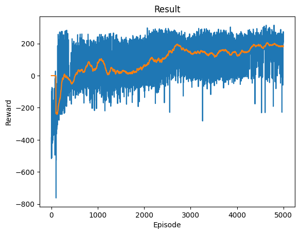

Link to complete project: https://github.com/daras-cu/gymnasium-3202

# gymnasium-3202
## CSPB 3202 Final Project - Deep Learning with Gymnasium

## Lunar Lander Deep Q Network

This is an implementation of a Deep Q Network agent in the OpenAI Gymnasium Box2D Lunar Lander environment.

### Environment Description:

From Gymnasium: "This environment is a classic rocket trajectory optimization problem. According to Pontryagin’s maximum principle, it is optimal to fire the engine at full throttle or turn it off. This is the reason why this environment has discrete actions: engine on or off."

The environment contains a lunar lander which must be landed between a pair of flags on the moon surface. The lander enters from the center top of the screen and is controlled by thrusters on the bottom, left, and right. It has two legs. In each state you may fire one of the thrusters. The environment can either be discrete or continuous; this implementation uses the discrete version.

------

### Environment Details:

__Action Space:__  Discrete(4)

__Actions:__ 
* 0: do nothing
* 1: fire left engine
* 2: fire bottom engine
* 3: fire right engine

__Observation Space:__ 8-dimensional vector containing the x and y coordinates of the lander, the linear velocity of the lander, the angle and angular velocity of the lander, and two booleans representing whether each leg is in contact with the ground or not

__Rewards:__ The total reward is a sum of the reward at each step, which depends on several factors like how close the lander is to the landing pad, its speed, angle, whether an engine is firing, and whether the legs are in contact with the ground. There is an additional reward at the end of the episode of -100 if the lander crashes or +100 if it lands safely. An episode is a solution if it scores at least 200 points.

__Version:__ "LunarLander-v2"

-------

### Algorithm: Deep-Q Network

A Deep-Q Network (DQN) is a reinforcement learning algorithm that uses Q-learning and deep neural networks. The DQN uses a neural network to approximate the Q-function and trains using a replay buffer, which enables it to use batches of past experiences for training rather than a single experience. This avoids over-fitting. To control the exploration and exploitation rate, a parameter epsilon is used which is gradually reduced. DQN is commonly used for game-type problems and many implementation examples exist for the Cartpole and Lunar Lander environments, so I thought it would be a good algorithm to explore for my own implementation.

------

### Process

#### Setup:

Before training, the following classes are defined:
* ReplayMemory - a replay buffer to store previous transitions, used to sample for training. Contains methods to push transitions to a deque, sample from the deque, and return the length of the deque.
* DQN - The DQN policy network. Computes the Q-values of a given state using hidden layers.
* QAgent - the agent to be used for training the DQN and returning actions once trained. Initializes various parameters for training as well as a ReplayMemory buffer and two DQN objects to use in training. Also defines functions for selecting actions and training the DQN.

In addition, a named tuple "Transition" is defined to store information about each transition.

#### Training:

The train function takes an environment and an agent as arguments, as well as parameters for the number of training episodes and epsilon values. For each episode, the function resets the environment, then asks the agent to select an action for the current state according to the DQN policy and tracks the reward until the episode reaches a terminal state. 

Each transition is stored in the replay memory buffer, and the model is optimized after a set number of cycles (defined by the learn_step parameter) using a random sample of transitions from the buffer. After each training episode, epsilon is updated to reduce the frequency of random actions as the policy is honed. A helper function also displays and updates a graph showing the rewards from each episode.

#### Hyperparameters:

I found that adjusting the hyperparameters in training had a huge effect on how successful my model was. In researching hyperparameters I found a great resource at https://drawar.github.io/blog/2019/05/12/lunar-lander-dqn.html which explained how each parameter affected the training process and identified some optimal values. I used these values as a guide and ran multiple trainings to see which worked best with my model. My final model used the following values:

__starting epsilon:__ 0.9

__epsilon decay:__ 0.99

__ending epsilon:__ 0.05

__batch size:__ 64

__learning rate:__ 1e-4

__gamma:__ 0.99

__learn step:__ 5

__tau:__ 1e-3

------

### Challenges

Initially, I tried to use one of the Atari environments for my project, but had difficulty importing the Atari environments so I settled on trying the Lunar Lander.

I originally adapted my Lunar Lander algorithm from an implementation of the Cartpole environment at https://pytorch.org/tutorials/intermediate/reinforcement_q_learning.html, which provided the basic structure and elements of the DQN algorithm. However, I knew I would need to make some changes to adapt it to the Lunar Lander environment. The first change I had to make was tracking the reward from each episode rather than the duration, which was relatively trivial.

Running the notebook on JupyterLab, I quickly realized that the speed of training was much too slow to be practical. I researched alternatives and transferred to Google Colab, which has GPU units available to run computationally-heavy algorithms. This sped up the training significantly and allowed me to start trying out different parameters.

I found that my model was not performing as well as I had hoped in training, so I found an implementation of DQN in the Lunar Lander environment to reference at https://github.com/yuchen071/DQN-for-LunarLander-v2/blob/main/LunarLander.ipynb. I discovered that I likely was not letting the training process run for long enough to achieve optimal results, as this notebook's training process went on for over 3500 episodes. 

I also noticed that this implementation wrapped more of the functions in the agent class, which I liked because it would make the algorithm more modular and able to be adapted to different environments in the future if I wanted. It also used a train_step parameter rather than updating the target network every episode, which I had read would lead to a more stable model. I reworked my code to combine the main logic from the Cartpole example with the structure of the Lunar Lander example. It was a huge challenge to figure out what each part of the code was doing and which elements of each example corresponded to the other, but I felt that through this process I gained a better understanding of how the DQN worked and ultimately ended up with code that is more clear and better-organized.

------

### Results

My most successful model trained over 5,000 episodes and had close to a 200 running reward average. The graph for this training run is below:

When I used the agent to run episodes of the Lunar Lander, it performed reasonably well:

I still think there is room for improvement, as my agent does not consistently score above 200 points.

------

### Future Goals

I would still like to improve the performance of my agent by continuing to adjust hyperparameters, changing the network layers, or by trying a different algorithm altogether. 

I would also like to test my model on some of the other Gymnasium environments. As noted, my initial intention was to use an Atari environment, and I would still like to figure out how to import and use one of those.

Overall I found the project challenging but rewarding when I got my model to work. Watching my agent play Lunar Lander and successfully land within the flags was fun!

------

### Tools

Gymnasium: https://gymnasium.farama.org/

Pytorch: https://pytorch.org/

Matplotlib: https://matplotlib.org/

Numpy: https://numpy.org/

IPython: https://ipython.org/

------

### References

https://pytorch.org/tutorials/intermediate/reinforcement_q_learning.html

https://github.com/yuchen071/DQN-for-LunarLander-v2/blob/main/LunarLander.ipynb

https://drawar.github.io/blog/2019/05/12/lunar-lander-dqn.html

https://pytorch.org/docs/stable/torch.html

https://www.youtube.com/watch?v=XFqGBnXzAoE

https://gymnasium.farama.org/

Cartpole Notebook supplied with project

------

By Danielle Aras
